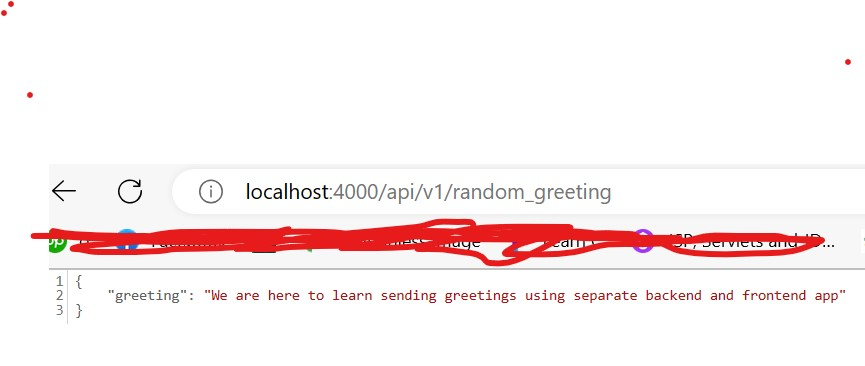

# 📗 Table of Contents



- [📖 About the Project](#about-project)
  - [🛠 Built With](#built-with)
    - [Tech Stack](#tech-stack)
    - [Key Features](#key-features)
 - [🚀 Live Demo](#live-demo)
- [💻 Getting Started](#getting-started)
  - [Setup](#setup)
  - [Prerequisites](#prerequisites)
  - [Install](#install)
  - [Usage](#usage)
  - [Run tests](#run-tests)
  - [Deployment](#deployment)
- [👥 Authors](#authors)
- [🔭 Future Features](#future-features)
- [🤝 Contributing](#contributing)
- [⭐️ Show your support](#support)
- [🙏 Acknowledgements](#acknowledgements)
- [📝 License](#license)

# 📖 hello-rails-back-end <a name="about-project"></a>

**hello-rails-back-end** is the api to generate the json response of greetings message and the client of this api is 
<a href="https://github.com/sajibarafatsiddiqui/hello-react-front-end.git">hello-react-front-end </a>" 

## 🛠 Built With <a name="built-with"></a>
 >Rails
 >Postgresql
### Tech Stack <a name="tech-stack"></a>

<details>
<summary>Ruby on Rails</summary>
  <ul>
    <li><a href="https://rubyonrails.org/">RubyonRails</a></li>
  </ul>
</details> 
<summary>Database</summary>
  <ul>
    <li><a href="https://www.postgresql.org/">PostgreSQL</a></li>
  </ul>
</details>

### Key Features <a name="key-features"></a>


- **Created and setup database using postgresql to store the greetings**
- **Created the rails api**
<p align="right">(<a href="#readme-top">back to top</a>)</p>

##🚀 Live Demo <a name="live-demo"></a>

- [Not depoyed yet]

<p align="right">(<a href="#readme-top">back to top</a>)</p>


## 💻 Getting Started <a name="getting-started"></a>

> This is an app where one can have the basic knowledge on how to create api using rails and create a react frontend app using that api

To get a local copy up and running, follow these steps.

### Prerequisites

In order to run this project you need:
- rails
- postgresql
  <br>


### Setup

Clone this repository to your desired folder:

  git clone git@github.com:sajibarafatsiddiqui/hello-rails-back-end.git

Install this project with:
npm install

### Usage

To run the project, execute the following command:
```sh
  cd hello-rails-backend-app
  rails s -p 4000
```
### Run tests

To run tests, run the following command:

rspec

Integration Test:
 rspec ./spec/feature
 
--->
### Deployment
 deploy this project using:

<!-

```sh
  render.yml
```
  
 -->

<p align="right">(<a href="#readme-top">back to top</a>)</p>


## 👥 Authors <a name="authors"></a>


👤 **Author1**

- GitHub: [@sajibarafatsiddiqui](https://github.com/sajibarafatsiddiqui)
- Twitter: [@SajibArafat](https://twitter.com/SajibArafat)
- LinkedIn: [sajibarafatsiddiqui](https://www.linkedin.com/in/sajibarafatsiddiqui/)
<p align="right">(<a href="#readme-top">back to top</a>)</p>


## 🔭 Future Features <a name="future-features"></a>

- Adding Styling

<p align="right">(<a href="#readme-top">back to top</a>)</p>


## 🤝 Contributing <a name="contributing"></a>

Contributions, issues, and feature requests are welcome!

Feel free to check the [issues page](../../issues/).


<p align="right">(<a href="#readme-top">back to top</a>)</p>

## ⭐️ Show your support <a name="support"></a>

> If you like the project Please do not hesitate if you have any questions

<p align="right">(<a href="#readme-top">back to top</a>)</p>

## 🙏 Acknowledgments <a name="acknowledgements"></a>


## 📝 License <a name="license"></a>

This project is [MIT](./LICENSE) licensed.

<p align="right">(<a href="#readme-top">back to top</a>)</p>
